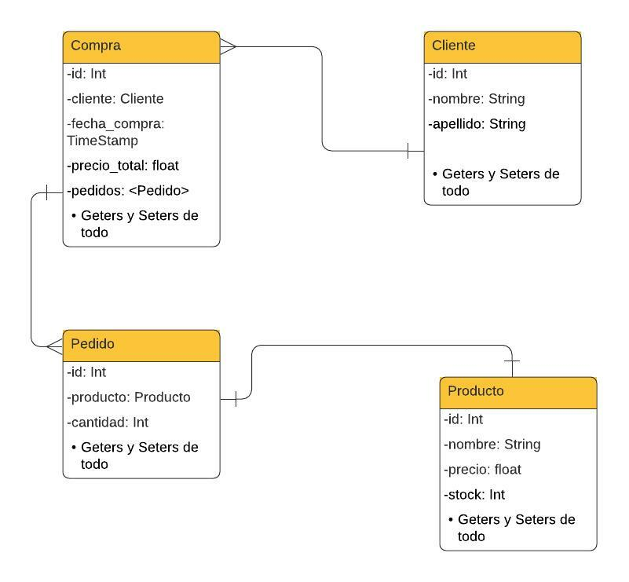
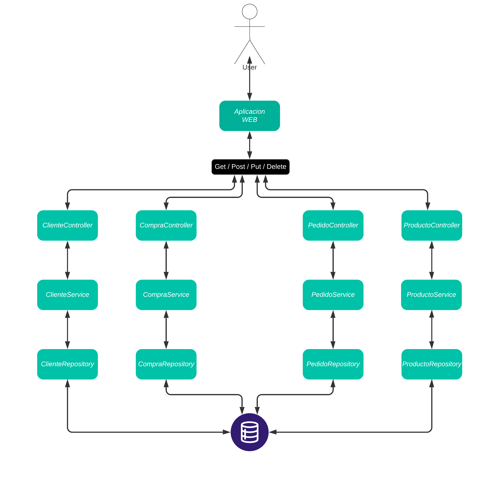

# Entregable Arquitecturas - Spring

***

### Introduccion

[Este trabajo práctico](https://drive.google.com/file/d/15WAHzqUo-oWN5brLN3y0yRt_ZnqPCjhQ/view) entregable fue propuesto para la materia **Arquitecturas Web** de la carrera **TUDAI**. 
El mismo consiste de un servicio *REST* y una interfaz que se conecte al mismo.

### Requisitos minimos

Teniendo como base el modelo de negocios de una despensa online que posee productos en stock y los clientes pueden comprarlos, fueron solicitados los siguientes requerimientos:

- Servicio de alta, baja y modificacion para la manipulacion de las entidades.
- Un reporte donde se puedan visualizar los clientes y las compras que estos han realizado.
- Un reporte de las ventas realizadas en un dia.
- Servicio de obtencion del producto mas vendido.
- Una interfaz Web conectada al servicio REST para la invocacion de los servicios solicitados.
- Documentacion integrada a la aplicacion.
- Tests de unidad para el codigo realizado.
- Despliegue de la aplicacion final en la plataforma Heroku.

### Diseño de la aplicacion

Una vez obtenidos los requerimientos se comenzo a realizar un diagrama de entidad relacion (**DER**) teniendo en cuenta las relaciones entre las entidades y los datos necesarios para cada una de ellas.

Luego de un tiempo de planificacion se llego al siguiente diagrama:

Dentro de la realizacion de este diagrama nos encontramos con un conflicto sobre la manera de realizar la relacion entre Cliente-Compra y Compra-Pedido.

Una vez debatidas las soluciones y aplicacion de las relaciones a la practica de la aplicacion se llego a que la opcion mas conveniente era que cada compra fuera de un cliente y esta tuviera una lista con los pedidos de los productos que el cliente solicitaba.

A su vez, cada pedido constaba de un unico producto y la cantidad solicitada del mismo.

### Implementacion en Spring

Terminada la etapa de planificion se comenzo a desarrollar la implementacion del servicio **REST** en JAVA con el framework SpringBoot.

Una vez iniciado el desarrollo, se tomo como primer tarea implementar las entidades a utilizar en el proyecto, siguiendo el diagrama realizado en la planificacion y realizando un controlador para realizar el mapeo de rutas del servicio REST a cada entidad.

Debido a que los clientes tenian un limite de compra de tres unidades de un mismo producto por dia, se implemento el patron repository y de esta manera agrupar las consultas mas complejas a realizar, dentro de una clase capaz de gestionarlas.

Para la obtencion de los reportes se propuso la implementacion de un patron de **Objeto de Transferencia de Datos** (*DTO*). De esta manera se podia almacenar datos conjuntos que pueden ser devueltos de la manera solicitada. Como fue el caso del reporte para los clientes, se pudo guardar el cliente y la cantidad total que gasto en sus compras unicamente desde una consulta a la tabla de compras, sin devolver los datos que no son necesarios.

Por otro lado, se realizo un metodo para que, al iniciar la base de datos, le ingrese una cantidad de datos random, de esta manera facilitando las pruebas y sin la necesidad de cargar manualmente los datos.
Al finalizar la implementacion de los servicios se comenzo a realizar pruebas con la ayuda de la plataforma ***Postman***, con la que fuimos capaces de encontrar y, mas adelante, solucionar algunos errores encontrados.

En cuanto a la interfaz Web, al terminar con las pruebas y verificar que todo estaba funcionando, se comenzo a diseñar y realizar en *HTML* y *Javascript*, con la ayuda *Bootstrap* para el estilo y simplificacion de componentes. Desde el lado de Javascript se realizaron las consultas al servicio REST implementado.

### Documentacion

Para la documentacion de esta aplicacion, se utilizo ***Swagger*** dentro de la misma aplicacion de Spring, dando como resultado una documentacion generada automaticamente. Dentro de esta documentacion se pueden encontrar todas las consultas posibles para el servicio con los datos necesarios (En caso de necesitarse) y las respuestas que retorna el mismo, detallando el tipo, mensaje y cuerpo de cada una.

Ademas, se pueden encontrar ejemplos de los modelos a utilizar en caso de querer probar una consulta que requiera que se le envien datos.

### Test de unidad

En cuanto a los test de unidad, fueron realizados integrando la aplicacion ***JUnit*** a nuestro servicio.

Realizando asi un testeo de cada servicio solicitado, manteniendo un orden para llevar a cabo estas pruebas en una clase separada para cada uno. Testeando de esta manera cada metodo implementado por separado y en orden para no generar conflicto entre los mismos.
***Si se desea correr los test de unidad*** se debera correr por separado.

### Conclusion

Al llegar al final de la etapa de desarrollo pudimos obtener un servicio REST funcional y una aplicacion Web conectada al mismo, pudiendo visualizar de manera grafica los datos que se transferian, asi como manipular las distintas entidades solicitadas por la catedra.

Una vez terminados los testeos, tambien se decidio incorporar un diagrama de solucion del sistema.

